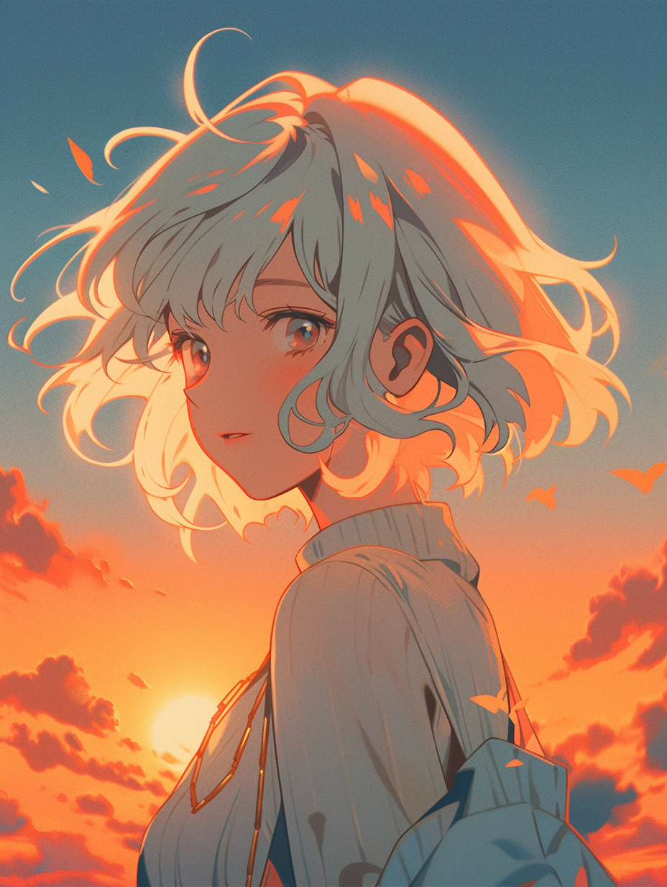
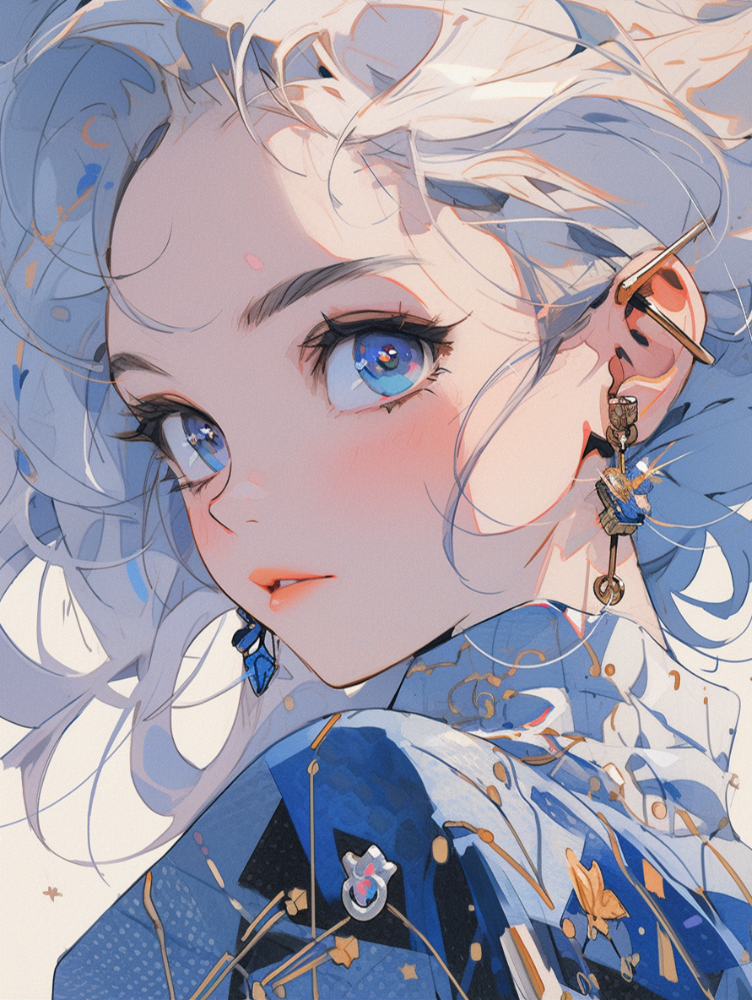

<!--
**milanaveed/milanaveed** is a ✨ _special_ ✨ repository because its `README.md` (this file) appears on your GitHub profile.

Here are some ideas to get you started:

- 🔭 I’m currently working on ...
- 🌱 I’m currently learning ...
- 👯 I’m looking to collaborate on ...
- 🤔 I’m looking for help with ...
- 💬 Ask me about ...
- 📫 How to reach me: ...
- 😄 Pronouns: ...
- ⚡ Fun fact: ...
-->

<!--
How to open preview in vscode: https://code.visualstudio.com/docs/languages/markdown#_markdown-preview
-->

### Hello, I am Mila, currently using this page as my portfolio.

I'm doing a Master's degree in Software Engineering at The University of Western Australia, graduating in June 2026.

- 🔗 This is my [space](https://littledatastructure.quora.com/) and [website](https://littledatastructure.netlify.app/) where I document my practice with data structures
- Let's make something good together. 

### My past projects are as follows:
👁️ [Computer Vision](https://github.com/milanaveed/cits4402-project) - Effective collaboration with 2 other developers. In this group research project, we performed face detection and matching. Tasks included GUI design, face detection, facial landmark detection, face alignment and display, identity clustering and reporting.

🚢 [Battleship](https://github.com/milanaveed/cits3002-labs/tree/main/22756463_BEER) - My multi-threaded two-player battleship game in the Computer Networks unit, where I practised interactive design, modularity and completed high-level tasks within a very limited amount of time. 

👁️ [OCTAVA] An open-source tool that performs eye image processing and analysis for microvascular data. Features include binarisation, skeletonisation, segmentation, regional analysis, batch processing and more to come. Collaborated with 5 other programmers. This is not published yet.

🖥️ [High Performance Computing] - An assignment of the CITS5507 HPC unit (parallelism). A collaboration between Zachary and me.

📊 [Sleep Diary App] - Led a team of 6 software engineering students in this 2-semester software design project. Co-designed and developed a Progressive Web App.

☁️ [Cloud Computing] - Assignments of the CITS5503 Cloud Computing unit. Amazon Web Services, Linux, Docker, DynamoDB, Django.

📖 [NLP - ABSA Research] - An Aspect-Based Sentiment Analysis research project in the Natural Language Processing unit.

🤖 [Machine Learning](https://github.com/milanaveed/cits5508/blob/main/assignment2/assig2_22756463.ipynb) - Assignment 2 of the CITS5508 Machine Learning unit with a grade of 96%. No use of AI-powered tools such as GitHub Copilot and ChatGPT.

🍄 [AI & Super Mario Bros](https://github.com/milanaveed/cits3001_project) - Implementation of unsupervised machine learning (reinforcement learning using Stable Baselines and PyTorch).

🐜 [Active Inference & Ant Colony Simulation] - Agent-based model written in Python that explores metrics for evaluating the presence of Stigmergy.

🔐 [Secure Coding in C] - CITS3007 Secure Coding project, taking care to avoid integer overflow and bad values to `calloc`.

<!--
reference: https://github.com/jaywcjlove/jaywcjlove/blob/master/README.md?plain=1
<!--
<!--
## My previous Midjourney AI creation for fun:

    

💛 May you have the courage to face and overcome life’s challenges 💛
    
   

    

        
        
        
        
        
        
    

-->
