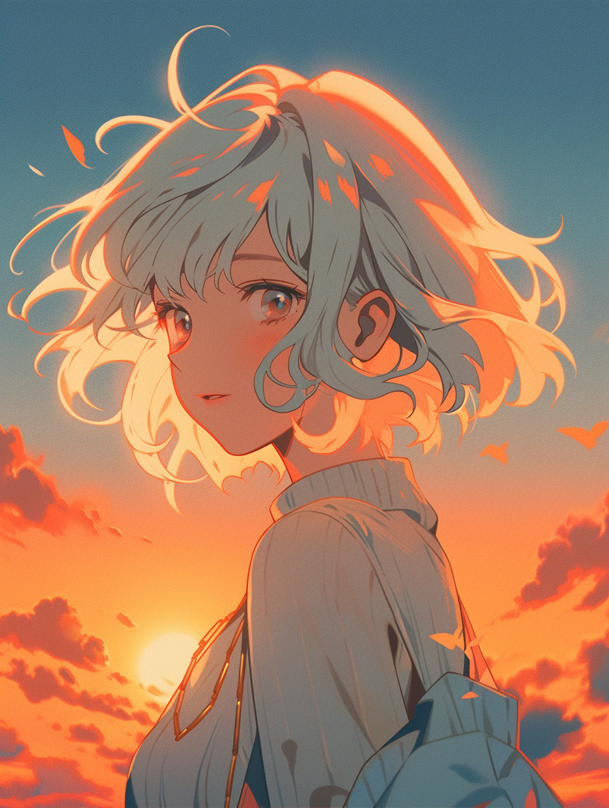

<!--
**milanaveed/milanaveed** is a ✨ _special_ ✨ repository because its `README.md` (this file) appears on your GitHub profile.

Here are some ideas to get you started:

- 🔭 I’m currently working on ...
- 🌱 I’m currently learning ...
- 👯 I’m looking to collaborate on ...
- 🤔 I’m looking for help with ...
- 💬 Ask me about ...
- 📫 How to reach me: ...
- 😄 Pronouns: ...
- ⚡ Fun fact: ...
-->

<!--
How to open preview in vscode: https://code.visualstudio.com/docs/languages/markdown#_markdown-preview
-->

### Hello, I am Mila 🌿

<!--
reference: https://github.com/jaywcjlove/jaywcjlove/blob/master/README.md?plain=1
<!--
<!--
## My previous Midjourney AI creation for fun:

    

💛 May you have the courage to face and overcome life’s challenges 💛
    
   

    

        
        
        
        
        
        
    

-->
